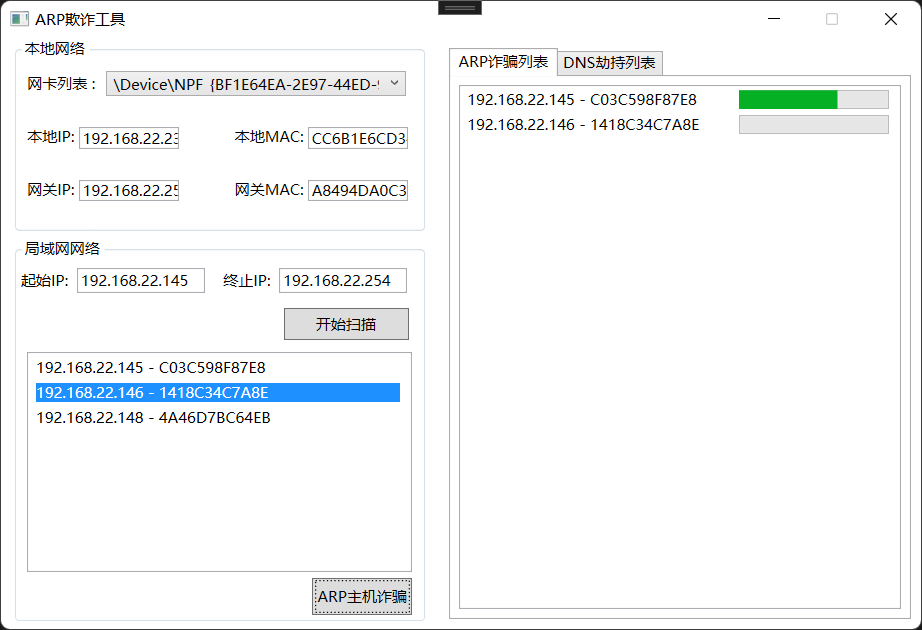

#### 代码说明文档：
https://www.cnblogs.com/qwqwQAQ/p/16968378.html

#### 如何运行？
##### 1.安装winpcap
https://www.winpcap.org/install/default.htm
##### 2.启动软件
###### 1源码启动
vs2022+.net6编译
###### 2发布软件启动
直接在release中下载。

##### 3.如何使用
1.切换最上面网卡下拉框直到能够自动加载ip和mac地址
2.设置网段，然后扫描
3.选择ip,攻击它。

#### TODO
dns劫持